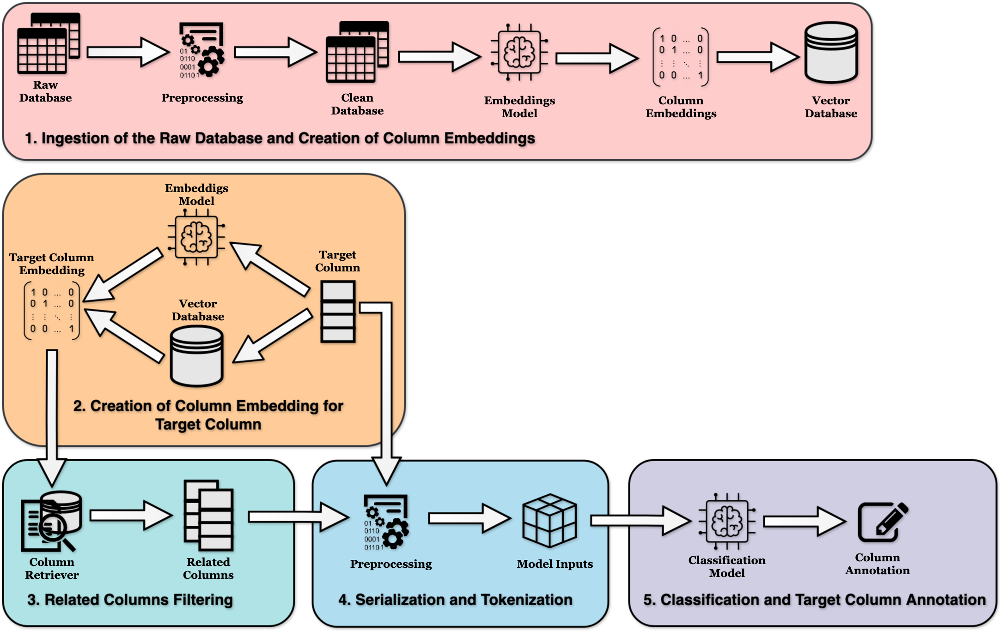

# LongSemAnnotator: A Longformer-based Framework Using Inter-Table Context for Column Type Annotation

Column-Type Annotation (CTA) is a crucial task in Semantic Table Interpretation (STI), with applications in data integration, search, and Knowledge Graph (KG) con- struction. Existing methods often struggle to handle large tables or incorporate contextual information from multiple tables. This thesis introduces a novel framework for STI that addresses these limitations.

Our framework utilizes sentence transformers to generate semantic embeddings for columns, enabling the identification of semantically similar columns across tables. We then employ a Longformer-based model, capable of processing long input sequences, to incorporate this inter-table context into the annotation process.

We evaluate our framework on the SOTAB benchmark, a dataset designed for CTA. The results demonstrate that our approach outperforms or matches state-of-the-art models in most test scenarios, particularly when trained on smaller datasets. We further analyze the model’s performance on various test sets, including those with missing values, format heterogeneity, and corner cases.

Our findings reveal that the inclusion of inter-table context and the use of the Long- former model significantly improve CTA accuracy. We also identify challenges in anno- tating certain column types with high semantic overlap, highlighting potential areas for future research. Overall, this work contributes to the advancement of STI by providing a more accurate, robust, and scalable framework for column type annotation.



## Key Features

* **Longformer-based:** Utilizes the Longformer model to capture long-range dependencies and contextual information within tables.
* **Semantic Similarity:** Incorporates semantic similarity measures to identify related columns and enhance annotation accuracy.
* **Inter-table Context:** Considers relationships between tables to improve disambiguation and annotation quality.

## Installation

1. **Clone the repository:**

   ```bash
   git clone https://github.com/tiagomosantos/LongSemAnnotator.git
   
2. **Data Preparation:**
   Run download_sotab.sh to download and process SOTAB CTA corpus.
   ```bash
   bash download_sotab.sh

3. **Dependencies:**
* Core Dependencies
  * python >= 3.11
  * transformers == 4.39.0
  * evaluate == 0.4.1
  * faiss-cpu == 1.8.0
  * torch == 2.0.1
  * numpy == 1.25.0
  * scikit-learn == 1.3.0
  * accelerate == 0.32.1
* Experiment Tracking and Visualization
  * wandb == 0.17.4 

   ```bash
   cd longsemannotator
   poetry shell
   poetry install

4. **Project Structure:**

   auxiliary_functions/: Contains helper functions for various tasks (filtering, preprocessing, serialization, tokenization).
checkpoints/: Stores saved model checkpoints during training.
data/:
    embeddings/: Contains precomputed word embeddings or other external resources.
    raw_data/: Directory for raw tabular data.
    ready_to_model_data/: Contains preprocessed data ready for model use.
    structured_data/: Stores structured data (e.g., knowledge graphs) for semantic annotation.
base_model.py: Defines the base Longformer model architecture.
build_lb.py: Constructs the LongSemAnnotator model with custom layers.
classification_layers.py: Implements the classification layers for CTA.
create_embeddings.py: Handles the creation and loading of word embeddings.
dataset.py: Defines the dataset class for loading and processing tabular data.
tokenize_serialize.py: Script for tokenizing and serializing raw data.
trainer.py: Script for training the LongSemAnnotator model.
pyproject.toml: Configuration file for Poetry, a dependency manager.

5. **Benchmark Models:**
   * Using full SOAB training dataset:
   https://huggingface.co/tiagomosantos/longsemannotator_sotab_full_cta
   * Using small SOTAB training dataset:
     https://huggingface.co/tiagomosantos/longsemannotator_sotab_small_cta
